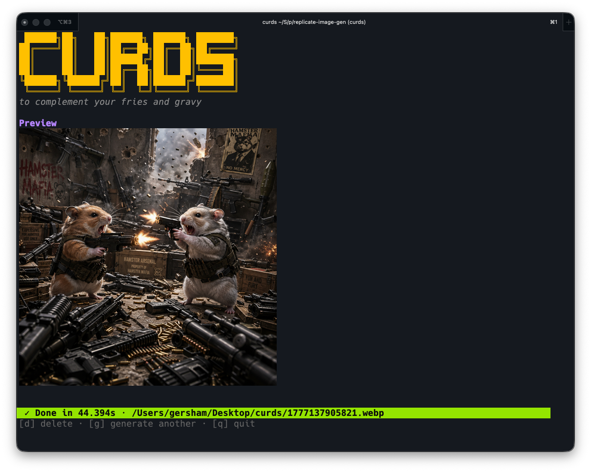

# curds

> _to complement your fries and gravy_



Generate images from the command line via OpenAI's gpt-image-2 (direct), or
images/videos via Replicate-hosted models such as Grok Imagine Video 1.5 and
Seedance 2.0. Also wraps Replicate's `bria/remove-background` for one-shot
transparent-PNG cutouts
(`-model remove-bg`). Logs upstream progress in colorized
[logfmt](https://brandur.org/logfmt). When prompt or token is missing
curds clears the screen and drops into a Bubble Tea TUI with a CURDS
banner, multiline prompt, spinner, scrolling log panel, and a "generate
another?" loop after each render.

## Requirements

- **Go 1.26+** for building (curds uses generics, structured logging, and
  recent stdlib helpers; older toolchains will refuse to compile).
  Install via [go.dev/dl](https://go.dev/dl/), Homebrew (`brew install go`),
  asdf, or your distro's package manager.
- **macOS, Linux, or Windows.** `-open` uses `open` on macOS,
  `xdg-open` on Linux, and `cmd /C start` on Windows.
- A terminal that supports ANSI colors and Unicode box drawing for the
  best TUI experience (any modern terminal qualifies — iTerm2, Alacritty,
  Kitty, Windows Terminal, GNOME Terminal, etc.).
- An API token from at least one provider:
  - [OpenAI](https://platform.openai.com/api-keys) — needs API
    Organization Verification to call gpt-image-2.
  - [Replicate](https://replicate.com/account/api-tokens) — alternative
    backend, no verification dance.
  - [xAI](https://console.x.ai) — native Grok Imagine Video (recommended
    for video; cheaper than the Replicate wrapper).
- Network access to `api.openai.com`, `api.replicate.com`, and/or
  `api.x.ai` (plus `replicate.delivery` / `vidgen.x.ai` for downloading
  rendered assets).

## Install

```bash
./install.sh                  # builds and installs to /usr/local/bin or ~/.local/bin
```

Or build manually:

```bash
go build -o curds ./cmd/curds
```

## First run

```bash
curds -prompt "a watercolor fox in a meadow"
```

Or with no flags at all to land in the TUI. On first run curds writes a
default config to `~/.config/curds/config.toml` and saves output to
`~/Desktop/curds/<unix_milli>.webp` for images, or `.mp4` for video models.

## Agent skill

`skill/` ships a standalone [Claude Code / agent skill](skill/SKILL.md) that
teaches an agent to drive the `curds` CLI: assemble the right flags, run one
command, verify the artifact, and report — without rewriting the prompt or
launching extra jobs. It's self-contained (`SKILL.md` + `reference.md`, no
external references), so installing curds and installing the skill go together.

**If you install curds for use by a coding agent, also install this skill** —
copy the directory into your skills location and the agent will know how to call
curds for images, edits, video, and background removal:

```bash
# Skip this if you already have a `curds` skill installed — don't clobber it.
test -d ~/.claude/skills/curds || cp -R skill ~/.claude/skills/curds
```

`~/.claude/skills/curds` is the per-user Claude Code location; adjust the
destination for your agent runtime. The guard above leaves any pre-existing
`curds` skill untouched.

## Interactive mode (TUI)

Triggered when prompt or token is missing (suppress with `-no-tui`).

- Clears the screen and renders the CURDS banner.
- Captures provider+token via a one-shot form when none is configured;
  optionally writes the token back to the config file.
- Multiline prompt input. `ctrl+d` submits, `ctrl+c` quits.
- During generation: spinner + a bordered, scrolling log panel showing
  every upstream event live (`generation.started`, `openai.request`,
  `image.received`, …).
- After generation: shows the saved path(s) and elapsed time.
  Press `g` to clear the prompt and generate again, `q` to quit.

## Tokens

Resolution priority (first non-empty wins):

1. `-token` flag
2. `[tokens]` section of `~/.config/curds/config.toml`
3. `.env` in the current working directory
4. process environment (`OPENAI_API_KEY`, `REPLICATE_API_TOKEN`)

If no token is found at startup, curds opens the TUI and offers to capture
one and (optionally) save it to the config.

## Providers

curds auto-selects the provider based on which token is available, with
OpenAI preferred for images when both are set. For MP4 output with no `-model`,
the native xAI provider is preferred when an `xai` token is available (cheaper
and more capable than the Replicate wrapper). Override with
`-provider openai|replicate|xai` or by setting `provider` in the config file.

| Provider  | Default model         | Endpoint                                                     |
|-----------|-----------------------|--------------------------------------------------------------|
| openai    | `gpt-image-2`         | `/v1/images/generations` (or `/v1/images/edits` with `-input-image`) |
| replicate | image: `openai/gpt-image-2`; video: `xai/grok-imagine-video-1.5` | `/v1/models/<owner>/<name>/predictions` (sync via `Prefer: wait`) |
| xai       | video: `grok-imagine-video` | `POST /v1/videos/generations` + `GET /v1/videos/{request_id}` (async polling) |

## Editing / composing with reference images

Pass `-input-image` (repeatable or comma-separated, up to 16). curds
switches to OpenAI's `/v1/images/edits` endpoint or Replicate's
`input_images` field automatically. JPEG inputs are transparently
re-encoded as PNG for the OpenAI edits endpoint — some camera JPEGs
(e.g. straight off an iPhone) are otherwise rejected with
`invalid_image_file`.

```bash
# Compose from two references
curds -input-image body-lotion.png,bath-bomb.png \
      -prompt "Relax & Unwind gift basket"

# Mask-driven inpainting (OpenAI only; mask must be PNG with alpha)
curds -input-image lounge.png -mask mask.png \
      -prompt "indoor lounge with flamingo in pool"
```

## Video generation

For MP4 output with no `-model`, curds prefers xAI's **native** Grok Imagine
Video (`grok-imagine-video`, provider `xai`) when an `xai` token is available,
and otherwise falls back to the Replicate-hosted `grok-imagine-video-1.5`
wrapper (`default_video_model`).

### Native xAI (`grok-imagine-video`)

The native API is roughly half the Replicate cost at 720p and supports
text-to-video (image optional), reference images, 1080p, and durations up to
15s. It is asynchronous: curds submits the job, polls
`GET /v1/videos/{request_id}`, then downloads the rendered MP4. Audio is
generated automatically.

```bash
# Text-to-video (no input image)
curds -prompt "a slow serene time-lapse of the milky way" -output /tmp/sky.mp4

# Image-to-video from a reference image, 1080p, 10s
curds -provider xai -input-image still.png \
      -prompt "a smooth product turn with soft studio camera motion" \
      -video-resolution 1080p -video-duration 10 -output /tmp/xai.mp4
```

Native `grok-imagine-video` supports:

- `-input-image` — optional image-to-video source (0 or 1).
- `-reference-image` — additional reference image(s).
- `-video-duration` — `1` through `15` seconds. Default: `5`.
- `-video-resolution` — `480p`, `720p`, or `1080p`. Default: `720p`.
- `-aspect-ratio` — `auto`, `1:1`, `16:9`, `9:16`, `4:3`, `3:4`, `3:2`, or
  `2:3`. `auto` is omitted from the request so the API derives it (from the
  source image, for image-to-video). Default: `auto`.

### Grok Imagine Video 1.5 via Replicate (`grok-imagine-video-1.5`)

The Replicate wrapper is image-to-video only, so pass exactly one
`-input-image`. Used as the MP4 fallback when no `xai` token is set, or
explicitly via `-provider replicate -model grok-imagine-video-1.5`.

```bash
curds -provider replicate -model grok-imagine-video-1.5 -input-image product.png \
      -prompt "a smooth product turn with soft studio camera motion" \
      -output /tmp/grok.mp4
```

Grok Imagine Video 1.5 supports:

- `-video-duration` — `1` through `15` seconds. Default: `5`.
- `-video-resolution` — `480p` or `720p`. Default: `720p`.
- `-aspect-ratio` — `auto`, `16:9`, `4:3`, `1:1`, `9:16`, `3:4`, `3:2`, or
  `2:3`. Default: `auto` unless overridden with `-aspect-ratio`.

Seedance 2.0 is still selectable through Replicate as the `seedance-2` model
key (`bytedance/seedance-2.0`):

```bash
curds -provider replicate -model seedance-2 \
      -prompt "a cinematic 5 second shot of a glass sculpture forming" \
      -aspect-ratio 16:9 -video-duration 5 -output /tmp/seedance.mp4
```

Seedance-specific support:

- `-video-duration` — `-1` for intelligent duration, or `4` through `15`
  seconds. Default: `5`.
- `-video-resolution` — `480p`, `720p`, or `1080p`. Default: `720p`.
- `-no-audio` — disables synchronized generated audio.
- `-seed` — optional deterministic seed.
- `-input-image` — one image becomes the first frame for image-to-video;
  multiple images are sent as Seedance `reference_images`.
- `-last-frame-image` — optional ending frame; requires `-input-image`.
- `-reference-image`, `-reference-video`, `-reference-audio` — multimodal
  references. In prompts, refer to them as `[Image1]`, `[Video1]`,
  `[Audio1]`, etc.

## Background removal / segmentation

`-model remove-bg` runs `bria/remove-background` (BRIA RMBG 2.0) on
Replicate. It takes one input image and returns a transparent PNG with a
soft 256-level alpha matte — the original pixels are preserved, only the
background is removed. There's no prompt, no aspect ratio, and no
`-quality` knob; the output dimensions match the input image.

```bash
curds -provider replicate -model remove-bg \
      -input-image photo.jpg -output cutout.png
```

Notes:

- Requires exactly one `-input-image` (file path, http(s) URL, or `data:` URL).
- Output format is forced to PNG so the alpha channel survives.
- `bria/remove-background` is an official Replicate model — no version pin.
- For dedicated mask outputs (rather than a finished cutout) you can also
  pass any other Replicate model identifier directly via `-model owner/name`,
  but only `bria/remove-background` is wired into the validation/format
  shortcuts.

## Aspect ratios

`-aspect-ratio` accepts these named ratios (mapped to multiples-of-16
sizes for gpt-image-2):

| Ratio       | OpenAI size  | Notes                          |
|-------------|--------------|--------------------------------|
| 1:1         | 1024×1024    |                                |
| 3:2 / 2:3   | 1536×1024 / 1024×1536 |                       |
| 4:3 / 3:4   | 1536×1152 / 1152×1536 |                       |
| 16:9        | 2048×1152     | ~1080p+ landscape              |
| 9:16        | 1152×2048    | ~1080p+ portrait               |
| 21:9 / 9:21 | 2688×1152 / 1152×2688 | ultrawide              |
| 2:1 / 1:2   | 2048×1024 / 1024×2048 |                       |
| 16:9-4k / 9:16-4k | 3840×2160 / 2160×3840 |                |

Replicate's gpt-image-2 wrapper accepts only `1:1`, `3:2`, `2:3`.
Grok Imagine Video 1.5 accepts `auto`, `16:9`, `4:3`, `1:1`, `9:16`,
`3:4`, `3:2`, and `2:3`.
Native xAI `grok-imagine-video` accepts `auto`, `1:1`, `16:9`, `9:16`,
`4:3`, `3:4`, `3:2`, and `2:3`.
Seedance 2.0 accepts `16:9`, `4:3`, `1:1`, `3:4`, `9:16`, `21:9`,
`9:21`, and `adaptive`.

For something custom, pass `-size WxH`. Anything not on a 16-pixel
boundary is rounded to the nearest valid value (true 1080p `1920×1080`
becomes `1920×1088`, for example).

## Configuration

`~/.config/curds/config.toml` (auto-created):

```toml
provider = ""                   # "openai", "replicate", "xai", or "" to auto-detect
default_model = "gpt-image-2"
default_video_model = "grok-imagine-video-1.5"  # MP4 fallback when no xai token

[output]
directory = "~/Desktop/curds"
format = "webp"
compression = 90

[tokens]
openai = ""
replicate = ""
xai = ""

[defaults]
quality = "auto"
aspect_ratio = "1:1"
background = "auto"
moderation = "auto"
number_of_images = 1

[models.gpt-image-2]
openai_name = "gpt-image-2"
replicate_name = "openai/gpt-image-2"

[models.grok-imagine-video]
xai_name = "grok-imagine-video"

[models.grok-imagine-video-1.5]
replicate_name = "xai/grok-imagine-video-1.5"

[models.seedance-2]
replicate_name = "bytedance/seedance-2.0"

[models.remove-bg]
replicate_name = "bria/remove-background"
```

Override the path with `$CURDS_CONFIG`.

## Logging

Every stage emits a logfmt event to stderr. On a TTY events are colorized;
piped output stays plain logfmt for log collectors. Add `-v` for
debug-level events (request bodies, etc.).

```
ts=2026-04-25T17:34:00.123Z level=info  event=curds.start version=0.1.0
ts=2026-04-25T17:34:00.140Z level=info  event=config.loaded path=…
ts=2026-04-25T17:34:00.180Z level=info  event=generation.started provider=openai size=2048x1152 prompt_chars=42
ts=2026-04-25T17:34:00.181Z level=info  event=openai.request endpoint=… kind=generations
ts=2026-04-25T17:34:08.420Z level=info  event=openai.response status_code=200 bytes=987432
ts=2026-04-25T17:34:08.421Z level=info  event=image.received index=0 bytes=987432 format=webp
ts=2026-04-25T17:34:08.435Z level=info  event=curds.completed images=1 duration_ms=8312 paths=…
```

Upstream errors are captured at `level=error`:

```
ts=… level=error event=openai.api_error status_code=400 body="{ \"error\": { … } }"
```

## CLI flags

Run `curds -h` for the full list. Highlights:

- `-prompt` — prompt text (or pipe via stdin, or use the TUI)
- `-output` — output path (default: `~/Desktop/curds/<ms>.<format>`)
- `-aspect-ratio` / `-size` — image dimensions
- `-quality` / `-output-format` / `-output-compression`
- `-input-image` — reference image(s), repeatable or comma-separated
- `-mask` — mask file for OpenAI edits
- `-video-duration` / `-video-resolution` — video controls
- `-no-audio` — Seedance-only audio control
- `-reference-image` / `-reference-video` / `-reference-audio` — Seedance references
- `-provider`, `-token`, `-model`
- `-open` — open generated assets in OS viewer (macOS Preview)
- `-verbose` — debug-level logs
- `-no-tui` — never enter interactive mode (fail instead)

## Layout

```
.
├── cmd/curds/main.go      package main — CLI shell
├── client.go              package curds — Client, Request, Result, providers
├── openai.go              ↑ OpenAI Image API impl
├── replicate.go           ↑ Replicate API impl
├── log.go                 ↑ shared logfmt + lipgloss formatter
├── curds_test.go          ↑ unit + httptest integration tests
├── config/                package config — TOML, .env, token resolution
├── tui/                   package tui  — huh-driven interactive form
├── skill/                 standalone agent skill (SKILL.md + reference.md)
├── install.sh             builds + installs to /usr/local/bin or ~/.local/bin
└── go.mod                 module github.com/gersham/curds
```

## License

Personal project. No license attached yet.
